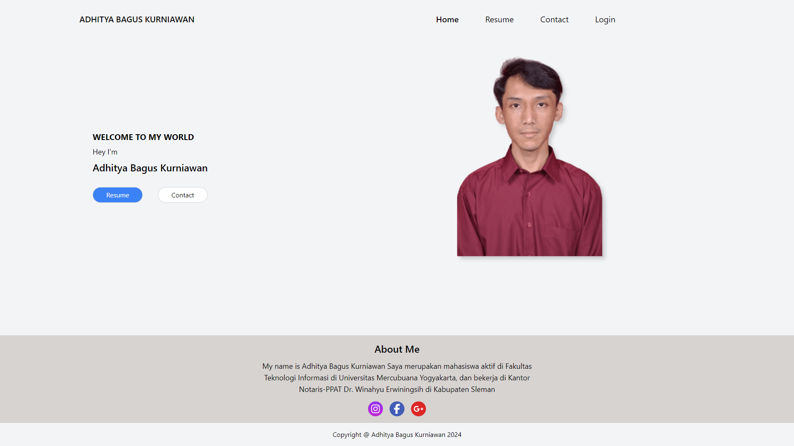
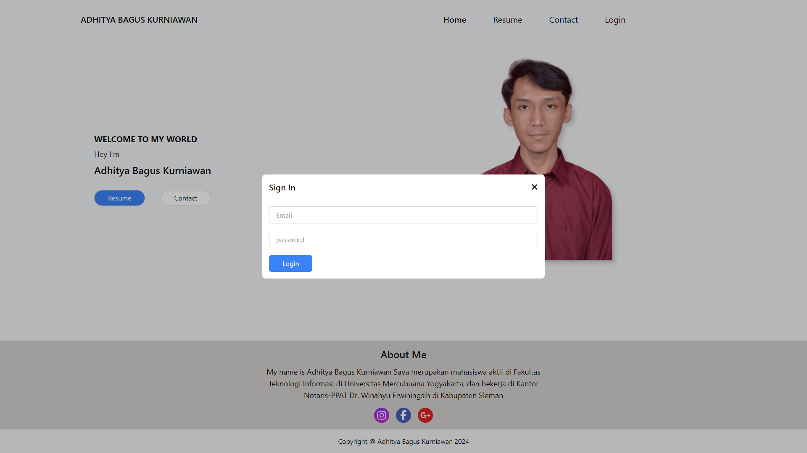
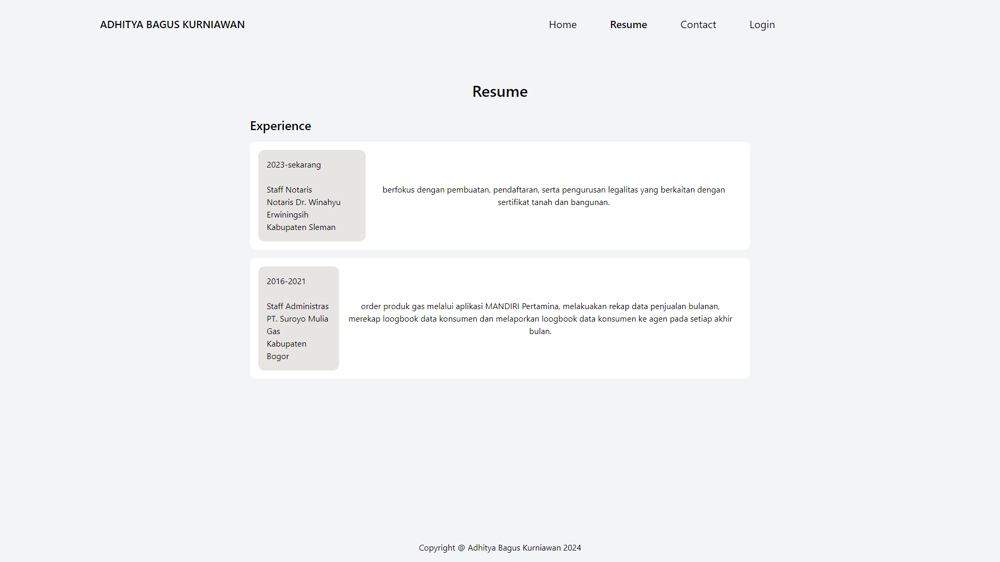
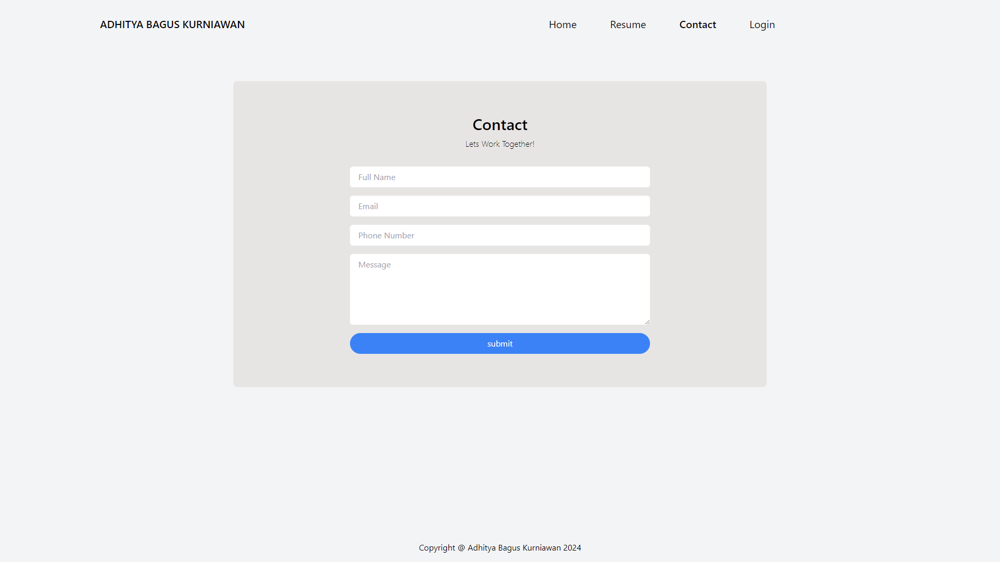
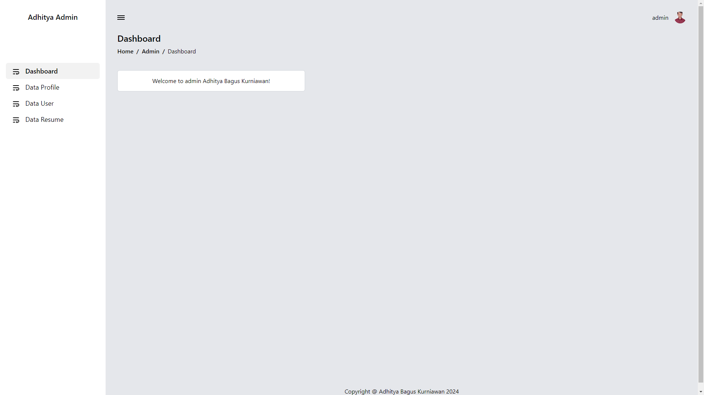
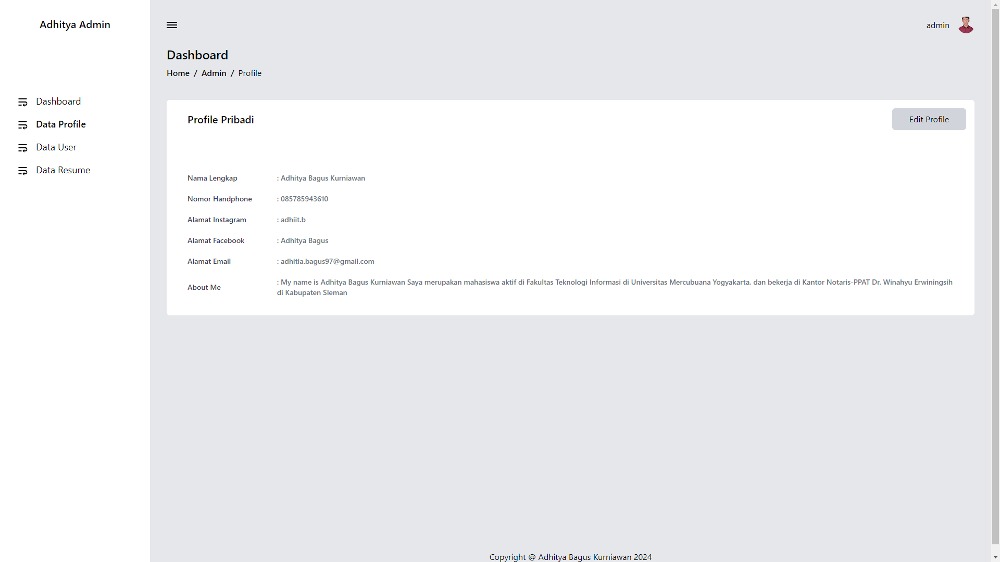
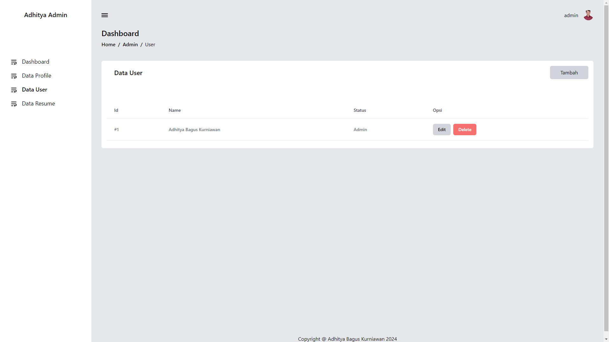

# Protofolio Adhitya Bagus Kurniawan

Aplikasi CRUD Portofolio

| Page         |                              Images                              |
| ------------ | :--------------------------------------------------------------: |
| Home         |   </img>    |
| Login        |   </img>   |
| Resume       |  </img>   |
| contact      |  </img>  |
| Dashboard    | </img> |
| Data Profile |  </img>  |
| Data User    |   </img>    |
| Data Resume  |  </img>   |

## Installasi

### Cloning

```bash
git clone https://github.com/SukunDev/protofolio-adhitya-bagus-kurniawan.git
cd protofolio-adhitya-bagus-kurniawan
```

### Install depedency

```bash
npm install
```

### Migration

```bash
php artisan migrate
php artisan migrate:fresh --seed
```

### Running

```bash
npm run dev

php atisan serve
```
